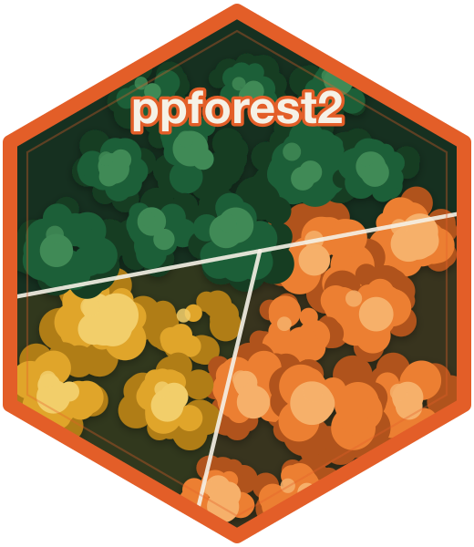

# ppforest2 

<!-- badges: start -->
[](https://github.com/andres-vidal/ppforest2-r/actions/workflows/r-check.yml)
[](https://CRAN.R-project.org/package=ppforest2)
[](https://www.repostatus.org/#active)
<!-- badges: end -->

ppforest2 provides projection pursuit oblique decision trees and random
forests for classification.  Instead of splitting on single variables,
each node projects the data onto a linear combination of features,
capturing structure that axis-aligned trees miss.

The package wraps a high-performance C++ core and is intended as a modern
successor to [`PPforest`](https://cran.r-project.org/package=PPforest).

Key capabilities: oblique splits via projection pursuit, multi-threaded
forest training (OpenMP), cross-platform reproducibility, three variable
importance measures (projection-based, weighted, permutation), LDA/PDA
optimisation, OOB error estimation, and
[parsnip](https://parsnip.tidymodels.org/) / tidymodels integration.

## Installation

```r
# install.packages("devtools")
devtools::install_github("andres-vidal/ppforest2-r", build = FALSE)
```

## Usage

### Single tree

```r
library(ppforest2)

model <- pptr(Species ~ ., data = iris)
predict(model, iris[1:5, ])
summary(model)
```

### Random forest

```r
forest <- pprf(Species ~ ., data = iris, size = 500)
predict(forest, iris[1:5, ])
predict(forest, iris[1:5, ], type = "prob")   # vote proportions
summary(forest)
```

### Regularisation (PDA)

When classes are highly correlated or the number of variables is large
relative to the sample size, penalised discriminant analysis can improve
separation:

```r
pptr(Species ~ ., data = iris, lambda = 0.5)
```

### Visualisation

ppforest2 provides four diagnostic plot types (requires
[ggplot2](https://ggplot2.tidyverse.org/)):

```r
# Mosaic overview: structure + importance + boundaries
plot(model)

# Individual plot types
plot(model, type = "structure")     # tree diagram with per-node histograms
plot(model, type = "importance")    # variable importance bar chart
plot(model, type = "projection")    # projected data at each split
plot(model, type = "boundaries")    # decision boundaries in feature space

# Forest: importance across all trees, or inspect individual trees
plot(forest)
plot(forest, type = "structure", tree_index = 1)
plot(forest, type = "boundaries", tree_index = 1)
```

### tidymodels integration

ppforest2 integrates with [parsnip](https://parsnip.tidymodels.org/):

```r
library(parsnip)

# Single tree
spec <- pp_tree(lambda = 0) |> set_engine("ppforest2") |> set_mode("classification")
fit  <- fit(spec, Species ~ ., data = iris)

# Random forest
spec <- pp_rand_forest(trees = 50, mtry = 2) |> set_engine("ppforest2")
fit  <- spec |> fit(Species ~ ., data = iris)
predict(fit, iris, type = "prob")
```

### JSON serialisation

Models can be saved and loaded in JSON format, enabling interoperability
with the C++ CLI and other language bindings:

```r
save_json(model, "model.json")
restored <- load_json("model.json")
```

## Relation to other packages

ppforest2 implements published methods that already have an R
implementation: projection pursuit classification trees (Lee, Cook, Park
and Lee, 2013, <doi:10.1214/13-EJS810>) and projection pursuit forests
(da Silva, Cook and Lee, 2021, <doi:10.1080/10618600.2020.1870480>),
available in [`PPforest`](https://cran.r-project.org/package=PPforest) and
[`PPtreeViz`](https://cran.r-project.org/package=PPtreeViz). It improves on
that implementation rather than introducing a new algorithm: the method is
implemented in C++ with multi-threaded forest training, results are
reproducible for a given seed across operating systems, and the package
adds experimental regression, three variable importance measures, JSON
serialization and tidymodels integration. For single trees, the projections
and predictions match `PPforest::PPtree_split()`; the package's tests check
this on five datasets, and
[`benchmarks/compare-ppforest.R`](https://github.com/andres-vidal/ppforest2-r/blob/main/benchmarks/compare-ppforest.R) times
forest training in both packages on simulated data.

[`ODRF`](https://cran.r-project.org/package=ODRF) also builds oblique trees
and forests, and offers several ways to choose the linear combinations, of
which projection pursuit is one. ppforest2 implements only the projection
pursuit trees and forests described above, following the `PPforest`
algorithm. `obliqueRF` and `oblique.tree`, two earlier oblique tree
packages, were archived on CRAN in 2022 and 2017.

## Life cycle

ppforest2 is stable for classification: the interface of `pptr()`,
`pprf()`, `predict()` and the variable importance functions is not expected
to change, and any change to it will go through a deprecation period first.
Regression support is experimental, and its defaults and outputs may change
in minor releases. Results for a given seed only change in a release that
documents the change in `NEWS.md`.

## Learning more

- `vignette("introduction")` — a tutorial covering trees, forests,
  visualisation, and tidymodels integration.
- [GitHub repository](https://github.com/andres-vidal/ppforest2-r) —
  source code and build instructions.
- [ppforest2-core](https://github.com/andres-vidal/ppforest2-core) —
  the C++ engine this package compiles, with its API reference (Doxygen),
  command-line interface, and benchmarks.
